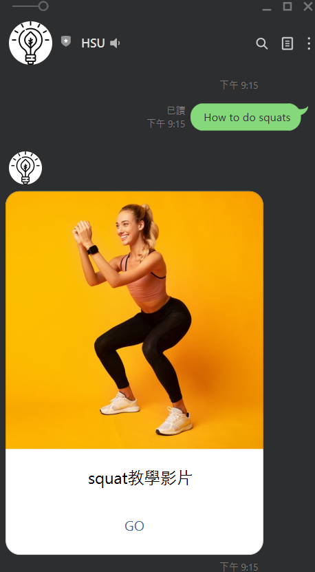

# Autogym_Linebot

A simple LineBot example with __Node.js__ and __google sheets__.

## Install
```sh
$ npm install @line/bot-sdk --save
$ npm install express --save
$ npm install request --save
```

## How to Work?
Create data and publish json using google sheets.
Use request to automatically recognize the input string if it contains keywords, it will respond to the corresponding answer.

Example:

input : ” How to do squat ? ” => output : squat video

 

----

 ## Linebot QR code

 If you are interested, you can scan the QR code to join.

 Will update again when I am free. :smirk:

 

 ----
 ## Reference
[Line official document](https://github.com/line/line-bot-sdk-nodejs)

[google sheets official document](https://support.google.com/docs/answer/183965?hl=zh-Hant&ref_topic=9083762)
